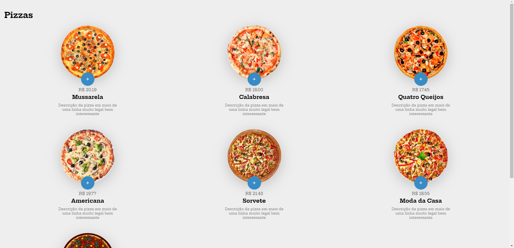

<h1 align="center"> Compra de Pizzas </h1>

  <a href="#-tecnologias">Tecnologias</a>&nbsp;&nbsp;&nbsp;|&nbsp;&nbsp;&nbsp;
  <a href="#-projeto">Projeto</a>&nbsp;&nbsp;&nbsp;|&nbsp;&nbsp;&nbsp;
  <a href="#-layout">Layout</a>&nbsp;&nbsp;&nbsp;|&nbsp;&nbsp;&nbsp;
  <a href="#memo-licença">Licença</a>

  

 

  

## 🚀 Tecnologias

Esse projeto foi desenvolvido com as seguintes tecnologias:

- HTML e CSS
- Javascript
- Git e Github

## 💻 Projeto

Uma página para compra de pizzas, onde é possível abrir um modal com a pizza selecionada e adicionar seus pedidos ao carrinho.

## 🔖 Layout

Você pode visualizar o layout do projeto através [DESSE LINK]().

## 🎖️ Licença

Esse projeto está sob a licença MIT.